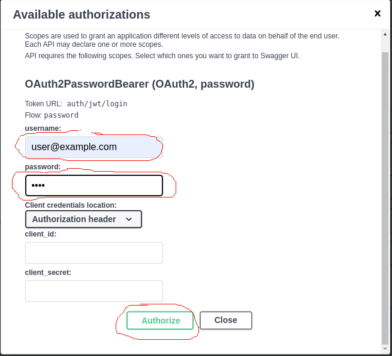

# Сервис "Социальная сеть"

##  Запуск
### команда на линукс:
    sudo docker compose up 
### команда на windows:
    docker-compose up

(!!!! перед запуском на windows необходимо в папке docker у файлов entrypoint.sh поменять кодировки окончания строк с CRLF на LF)

### Cтраница документации:
[http://0.0.0.0:8000/docs](http://0.0.0.0:8000/docs)

Эндпоинт для регистрации по пути: http://0.0.0.0:8000/auth/register

Затем необходимо ввести те же данные для авторизации как на скриншоте

  

Сделано кеширование лайков постов на определенное количество секунд. 
Переменная TIME_CACHE отвечающая за длительность времени кеширования находится в ".env" файле.
По истечению срока кеширования, при следующем запросе поста, количество лайков и дизлайков заносится в кеш повторно.
При оценивании поста количество лайков и дизлайков обновляется в кеше тоже.

На like или dislike сделаны отдельные эндпоинты /post/{post_id}/add_like и /post/{post_id}/add_dislike соответственно.
При попытке поставить лайк или дизлайк на собственный пост выдаст соответствующую ошибку

